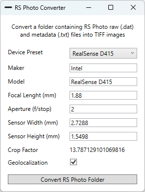

# RS Photo Converter

Convert [RS Photo](https://play.google.com/store/apps/details?id=com.majinsoft.rsphoto) data to TIFF images with EXIF/XMP metadata.

Images can be geolocalized for photogrammetry / computer vision applications such as 3D reconstruction.

# Workflow

Note: Smartphone JPG files are not modified and are already ready to use

# Data Sources

- Intel Realsense D400 series devices: Depth, IR and Color data

- Android Smartphone: Location and Rear Camera Color data

Still and Continous mode is supported by the RS Photo app, but we recommend taking still pictures to avoid Rolling Shutter and blurried images.

# Setup Example

- Android Smartphone with USB-C
- Intel Realsense D400 series camera
- Table tripod (ex. Manfrotto PIXI or similar) or a stabilized Gimbal
- Phone holder with Cold Shoe (ex. Manfrotto Mcpixi or similar)
- Cold Shoe Mount (ex. Smallrig 761 or similar)

# 3D Reconstruction Application Notes

- Avoid the video mode and to take multiple pictures from still positions to avoid blurriness, rolling shutter (on D415), etc..

- For an accurate 3D reconstruction use a mixed Point Cloud / Photogrammetry approach by using Sfm (Structure from Motion) and importing Color and Depth images with metadata. Examples of commercial and open source Sfm software are: Agisoft Metashape, Reality Capture, Meshroom, etc..

- A Depth Camera alone is not enough for photorealistic results, an high-resolution camera (ex. Smartphone, DSLR, Mirrorless) will greatly help with additional point-of-view and are recommended for texture generation.

- Use point cloud confidence filters to cleanup your data. The point cloud confidence map is a measure of how many times a point is "seen" by multiple camera. Remove low-confidence points.

- Cloud Compare is a great software that can be used for further refinements of the Point Cloud. We suggest the "Statistical Outlier Filter".

- Accuracy can be measured only with the use of many "truth" position and distances. GCP (Ground Control Point) and Scale Bars can be used as control and check points. Put GCP and scale bars over all the scan area and on every axes to avoid model drifts.

# RS Photo Converter Requirements

[.NET Desktop Runtime 6](https://dotnet.microsoft.com/en-us/download/dotnet/6.0)

# Android App

[RS Photo](https://play.google.com/store/apps/details?id=com.majinsoft.rsphoto)

# Disclaimer

INTEL REALSENSE is a trademark of Intel Corporation. Majinsoft is NOT endorsed by Intel in any way.