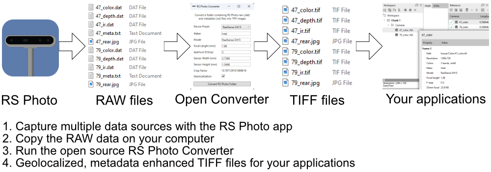
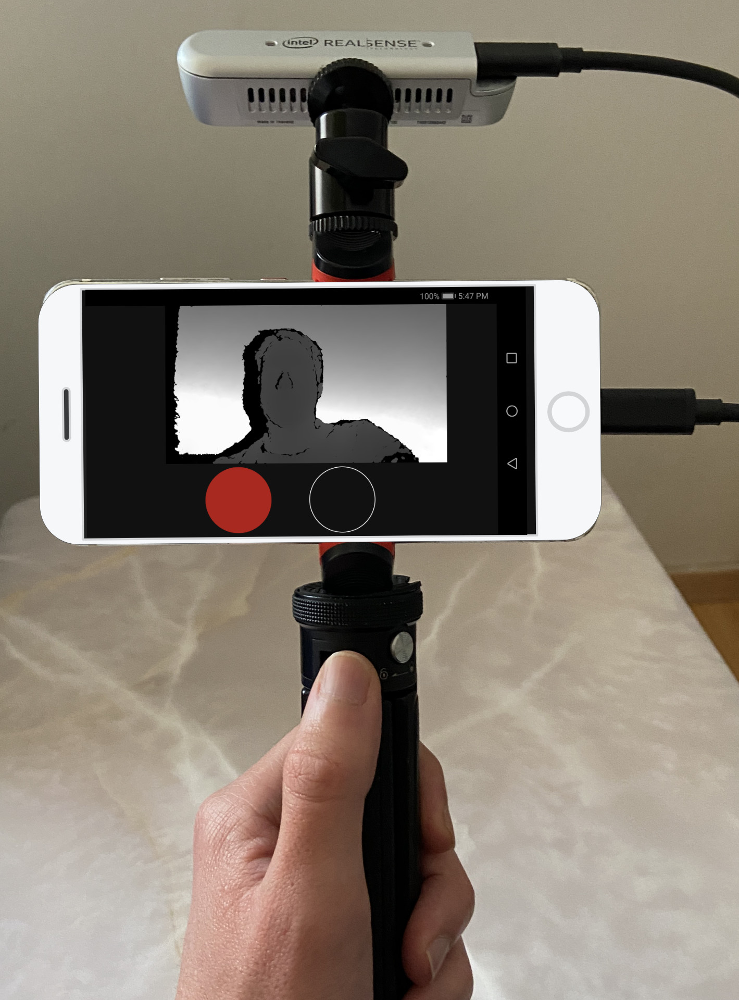

# RS Photo Converter

Convert [RS Photo](https://play.google.com/store/apps/details?id=com.majinsoft.rsphoto) data to TIFF images with EXIF/XMP metadata.

Images can be geolocalized for photogrammetry / computer vision applications.

# Workflow

# Data Sources

- Intel Realsense D400 series devices: Depth, IR and Color data

- Android Smartphone: Location and Rear Camera Color data

Still and Continous mode is supported by the RS Photo app, but we recommend taking still pictures to avoid Rolling Shutter and blurried images.

# Setup Example

- Android Smartphone with USB-C
- Intel Realsense D400 serie camera
- Table tripod (ex. Manfrotto PIXI or similar)
- Phone holder with Cold Shoe (ex. Manfrotto Mcpixi or similar)
- Cold Shoe Mount (ex. Smallrig 761 or similar)

# Requirements

[.NET Desktop Runtime 6](https://dotnet.microsoft.com/en-us/download/dotnet/6.0)

# App Links

[RS Photo](https://play.google.com/store/apps/details?id=com.majinsoft.rsphoto)